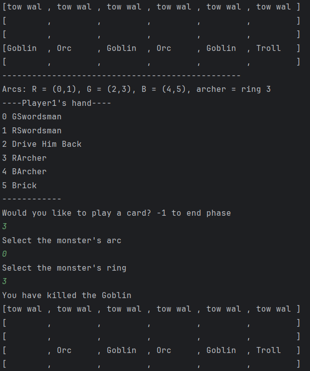
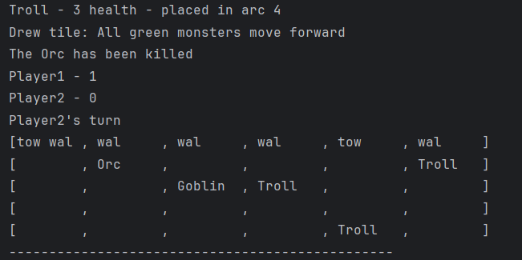
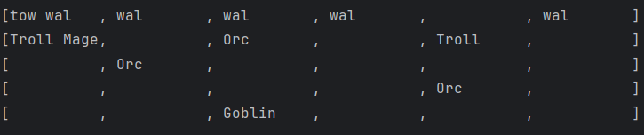

# Castle Panic Emulator

This fully functional digital recreation of the popular board game <em>Castle Panic</em> features all base game enemies, tiles, and cards, with robust rule enforcement. Enjoy the classic 2-4 player strategy game without the need for any physical components.

The text-based interface intuitively captures the complex movement of the traditionally 360 degree board without being overwhelming to new players.

## Combat
Phase order, enemy movement, and cards work just like the physical game. Prepare your archers and take down the monsters!

## End of Round
With scorekeeping, tile reavealing, and board updates done automatically, you have more time to strategize for the next wave.

## Just make sure to keep the enemies away from the castles!

## <em>The Wizard's Tower</em> expansion coming soon!
This expansion brings a new deck type, more in depth targeting mechanics, and complex bosses. Please stay tuned as these features are added to the digital adaptation.